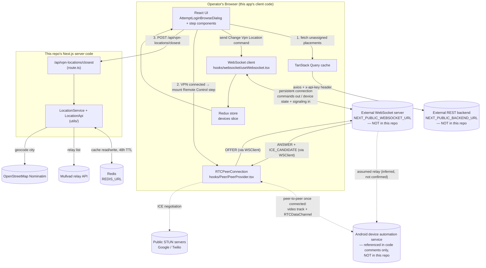

# plug_and_play

> This README is written to be a **complete context document** — for a human with no technical background, and for any coding agent that will work on this codebase afterward. It documents what was actually found in the repository, not what the folder names imply. Where something could not be confirmed by reading the code, it is explicitly marked **"Not determined from the current codebase."**

---

## 1. Project Overview

**In plain language:** this application is a small internal control panel (a website you open in a browser) used to remotely log an Instagram account into a physical Android phone (or emulator) over the internet. It picks a device, switches its VPN to the right location, and then hands the operator a live, interactive remote-control session — like remotely controlling someone else's phone in real time — so they can watch the phone's screen and type/tap on it directly to finish the login, including handling any 2FA code or trust-this-device prompt Instagram shows.

More specifically, the app currently implements one complete workflow, called **"Attempt login"**:

1. A pool of Android devices ("placements") is registered somewhere else (an external backend service). Some of these devices are online and don't yet have an Instagram account assigned to them.
2. The operator clicks a single **"Attempt login"** button.
3. The app randomly picks one device that is currently online ("connected") and not already busy running something else.
4. The operator types the city the Instagram account is supposed to be logging in from (e.g. "Amsterdam"). The app looks up the nearest VPN server location to that city and lets the operator pick one.
5. The app tells the physical device (over a live connection) to switch its VPN to that location.
6. Once the device confirms the VPN switch worked, the app **does not** ask the operator for Instagram credentials. Instead, it immediately opens a **live, interactive, two-way remote-control session** with the device — like remotely controlling someone else's phone in real time (video of the screen, plus the ability to tap/scroll/type on it) — so the operator logs the account in themselves, by hand, while watching exactly what Instagram shows.
7. The operator ends the session by clicking "Finish" whenever they're done (there is no automatic "success"/"failure" detection for this manual step — see Section 23).

**Problem it solves:** logging a real Instagram account into a real phone, through a specific VPN exit location, is a manual, fiddly, multi-step process — picking a device, switching its VPN, and then actually being able to see and operate its screen from a browser. This app turns the device-picking and VPN-switching part into a guided flow, and then hands the operator a live remote-control session to finish the login by hand, instead of them SSH-ing into a device or using a separate remote-desktop tool.

**Who/what uses it:** an internal operator (a person), through a web browser. There is no end-customer-facing part in this repository.

**Major capability implemented today:** the "Attempt login" flow described above (VPN location selection → VPN switch → live Remote Control hand-off). Other placement-management features may exist in the wider product but are **not** part of this repository.

---

## 2. How the System Works

This repository is **one piece of a larger system**. It is a [Next.js](https://nextjs.org) web application (a type of website that can also run small server-side code) that acts as the **operator-facing control panel**. It does not itself run the Instagram automation — it talks to two other systems that live outside this repository:

```text
Operator's browser (this app's UI)
      ↓ REST call (read-only: "give me the list of devices without an account yet")
External backend API  (NEXT_PUBLIC_BACKEND_URL — NOT in this repository)
      ↓ (this backend owns the real device/placement records)

Operator's browser (this app's UI)
      ↕ persistent WebSocket connection (commands out, live status + screen frames in)
External WebSocket server (NEXT_PUBLIC_WEBSOCKET_URL — NOT in this repository)
      ↕ (assumed relay to the physical Android device — see note below)
Android device running an automation service (NOT in this repository)

Operator's browser (this app's UI)
      ↓ POST /api/vpn-locations/closest (this IS part of this repository — a Next.js server route)
This app's own server code
      ↓
Redis cache (REDIS_URL) ← → Mullvad VPN relay list API ← → OpenStreetMap Nominatim (city → coordinates)
```

**Note on the Android side:** this repository never talks to an Android device directly — it only talks to the WebSocket server. Code comments inside the ported hooks (`useSubmit2FA.tsx`, `useChangeVpnLocation.tsx`) reference specific Android/Kotlin source files by name — `VpnAutomationManager.kt`, `MyAccessibilityService`, `TwoFaHandler`, `MessageRouter.kt` — as the place where these commands are actually handled on the device side. **That Android/Kotlin source is not part of this repository.** Its existence is inferred from these comments, not confirmed by reading its code.

So, concretely, this repository is a **frontend + two small server-side pieces**:

- A React/Next.js UI (the "Attempt login" flow).
- A Redux store that mirrors live device state pushed over the WebSocket.
- One real Next.js API route (`/api/vpn-locations/closest`) that does a small, self-contained job: given a city name, return the 5 nearest VPN server locations, using Redis as a cache.

Everything else (the actual account database, the actual device fleet, the actual Instagram automation) lives in services this repository only *talks to*, and whose internal code is outside this repository.

---

## 3. Complete Architecture

| Component | Responsibility | Why it exists | What it talks to |
|---|---|---|---|
| **Next.js App Router frontend** (`app/`) | Renders the operator UI; runs entirely in the browser except for the one API route | Lets an operator drive the login flow visually instead of via scripts | The external REST backend, the external WebSocket server, this app's own `/api/vpn-locations/closest` route |
| **Redux store** (`store/`) | Single client-side source of truth for live device state (`devices` slice), keyed by `deviceId` | The WebSocket pushes many small state updates per device; components read from Redux instead of each managing their own subscription | Populated by `hooks/websocket/useWebsocket.tsx`; read by UI components via `useAppSelector` |
| **TanStack Query** (`libs/TanstackProvider.tsx`) | Caches/manages the one-shot REST fetch of unassigned placements and the VPN-location lookup mutation | Avoids manual loading/error state plumbing for REST calls | `useUnassignedPlacements`, `useLocation` |
| **WebSocket client layer** (`hooks/websocket/`) | Opens and maintains one shared WebSocket connection to the external automation server; auto-reconnects every 3s on drop; fans out every raw message to Redux and to any ad-hoc listener (e.g. WebRTC signaling messages) | A single shared socket avoids each component opening its own connection; some messages (WebRTC `ANSWER`/`ICE_CANDIDATE`, and `SCREEN_FRAME`) are too specialized or too high-frequency to put in Redux | External WebSocket server (`NEXT_PUBLIC_WEBSOCKET_URL`) |
| **Peer / WebRTC layer** (`hooks/Peer/`, `hooks/DeviceMonitoring/`) | Owns one shared `RTCPeerConnection` (`PeerProvider`), and drives the offer/answer/ICE-candidate signaling for a Remote Control session over the same shared WebSocket, plus translates operator clicks/gestures/typing into commands sent over an `RTCDataChannel` | Lets the operator see a live video of the device's screen and interact with it directly, instead of the app automating credential entry | The WebSocket client (for signaling), the browser's native WebRTC APIs, and (once connected) the device directly via a peer-to-peer video track + data channel |
| **LoginAttempt feature** (`app/feature/LoginAttempt/`) | Implements the entire "Attempt login" workflow: device pick → VPN location → VPN switch → live Remote Control hand-off | This is the one business workflow currently implemented in the app | Redux (`devices` slice), the WebSocket client, the Peer/WebRTC layer, `/api/vpn-locations/closest` |
| **Placement feature** (`app/feature/placemenet/`) — *note: folder is spelled `placemenet`, not `placement`, in the actual codebase* | Fetches the list of "unassigned" placements (devices with no Instagram account yet) from the external backend, and cross-references it with live Redux connection/automation state | Supplies the pool of devices the LoginAttempt flow picks from | External REST backend (via `libs/AxiosInstance.ts`), Redux `devices` slice |
| **VPN location service** (`utils/`, `app/api/vpn-locations/closest/route.ts`) | Given a city, geocodes it (OpenStreetMap Nominatim), fetches the current Mullvad VPN relay list, ranks relay cities by straight-line distance (Haversine formula), and returns the 5 closest, caching both lookups in Redis for 48 hours | VPN location must be chosen to match where the "real" login is supposed to appear to come from; recomputing/re-fetching on every request would be slow and would hammer both external APIs | OpenStreetMap Nominatim, the public Mullvad relay API, Redis |
| **Redis** (`libs/RedisClient.ts`, via `REDIS_URL`) | Cache only — geocoded city coordinates and the Mullvad relay list (48h TTL) | Avoids repeated calls to Nominatim/Mullvad for the same city/VPN app | Read/written only by `utils/LocationApi.ts` |
| **`comman/`** (note: not "common" — actual folder name) | Small cross-cutting type/constant definitions: `AutomationType` (the fixed list of automation command names) and `ServiceResult<T>` (a `{ success, data?, message? }` envelope used by API wrapper classes) | Shared vocabulary between the WebSocket command senders and the REST API wrapper | Used throughout `app/feature/*` |
| **`components/ui/`** | Generated [shadcn/ui](https://ui.shadcn.com) primitives (Button, Dialog, Input, Label, Select, Badge, Sonner toaster, Alert Dialog) in this project's `radix-nova` style, built on the unified `radix-ui` npm package | Consistent, accessible UI primitives without hand-rolling dialogs/selects | Used by every feature component |
| **`components/AppDialog.tsx`** | Thin wrapper over the shadcn Dialog primitives (`open`/`onOpenChange`, `title`, `description`, `footer`, `children`) | One consistent dialog shape reused by every step of the login flow | `AttemptLoginBrowseDialog` |
| **`components/Toasts.tsx`** | `successToast(message)` / `ErrorToast(message)` helpers around the `sonner` toast library | Consistent success/error notification styling | Called from hooks and step components throughout `LoginAttempt` |

### Architecture diagram



### Not present in this repository

To be explicit about scope, the following are **not** implemented here (confirmed by inspecting the file tree and dependencies):

- No database or ORM (no Prisma, no SQL client, no schema file).
- No authentication/session system for the app itself (see Section 10).
- No payment integration.
- No file/object storage integration.
- No background job runner, cron, or queue (Redis here is used purely as a cache, not as a queue).
- No automated tests.
- No CI/CD configuration (no `.github/workflows`, no Dockerfile, no `vercel.json`) found in the repository.

---

## 4. Repository / Folder Structure

```text
plug_and_play/
├── app/
│   ├── api/
│   │   └── vpn-locations/closest/route.ts   ← the only real backend endpoint in this repo
│   ├── feature/
│   │   ├── LoginAttempt/                    ← the "Attempt login" workflow (this repo's main feature)
│   │   │   ├── component/
│   │   │   └── hooks/
│   │   └── placemenet/                      ← (sic — actual folder name, not "placement")
│   │       ├── api/
│   │       ├── hook/
│   │       ├── types/
│   │       └── utils/
│   ├── globals.css
│   ├── layout.tsx                           ← root layout: mounts Redux, TanStack Query, WebSocket providers
│   └── page.tsx                             ← the app's only page; renders the login-attempt button/dialog
├── comman/                                  ← (sic — actual folder name, not "common")
│   ├── AutomationType.ts
│   └── interfaces.ts
├── components/
│   ├── AppDialog.tsx
│   ├── Toasts.tsx
│   └── ui/                                  ← generated shadcn/ui primitives
├── hooks/
│   ├── websocket/
│   │   ├── useWebsocket.tsx                 ← owns the actual WebSocket connection
│   │   └── WebsocketProvider.tsx            ← React context wrapper around useWebsocket
│   ├── Peer/
│   │   └── PeerProvider.tsx                 ← owns the shared RTCPeerConnection (WebRTC)
│   └── DeviceMonitoring/
│       ├── useDeviceMonitoring.tsx          ← WebRTC signaling for a Remote Control session
│       └── useAction.tsx                    ← translates clicks/gestures/typing into DataChannel commands
├── lib/
│   └── utils.ts                             ← re-exports `cn` from the `cn` npm package
├── libs/
│   ├── AxiosInstance.ts                     ← axios client for the external REST backend
│   ├── RedisClient.ts                       ← shared ioredis client
│   └── TanstackProvider.tsx
├── store/
│   ├── ReduxProvider.tsx
│   ├── redux-middleware.ts                  ← cross-tab BroadcastChannel sync (see Section 23 — currently dormant)
│   ├── slices/devices/
│   │   ├── devices.interface.ts
│   │   └── devices.slice.ts
│   └── storeConfig.ts
├── utils/
│   ├── LocationApi.ts                       ← talks to Nominatim + Mullvad + Redis
│   ├── service/LocationService.ts           ← ranks VPN locations by distance
│   └── vpnApp.ts
├── constants.ts
├── components.json                          ← shadcn/ui config
├── AGENTS.md / CLAUDE.md                    ← instructions for AI coding agents about this Next.js version
├── package.json
└── .env                                     ← NOT committed to git (see .gitignore); holds real secrets locally
```

### Important paths

| Path | Purpose |
|---|---|
| `app/feature/LoginAttempt/component/attempt-login-browse-dialog.tsx` | **The orchestrator.** Owns all state for the entire login flow, derives which step to show, and renders the flow dialog. Start here for anything related to the login flow. |
| `app/feature/LoginAttempt/component/attempt-login-location-step.tsx` | Step 1 UI: enter a city, fetch nearest VPN locations, pick one. |
| `app/feature/LoginAttempt/component/attempt-login-remote-control-step.tsx` | Step 2 UI: live WebRTC video of the device plus tap/scroll/type controls, so the operator can log the account in by hand. Renders `useDeviceMonitoring` + `useAction`. |
| `app/feature/LoginAttempt/component/live-device-screenshot.tsx` | Renders the low-frequency live device screen (base64 JPEG) fed by `useLiveScreenFrame`, shown during the VPN-location/connecting steps (before the WebRTC video takes over). |
| `app/feature/LoginAttempt/hooks/useChangeVpnLocation.tsx` | Sends the `"Change Vpn Location"` WebSocket command. |
| `app/feature/LoginAttempt/hooks/useLiveScreenFrame.tsx` | Subscribes to `SCREEN_FRAME` WebSocket messages for one device. |
| `hooks/Peer/PeerProvider.tsx` | Global `RTCPeerConnection` + `createOffer`/`setRemoteAns`/`resetPeer` helpers, mounted once at the app root. |
| `hooks/DeviceMonitoring/useDeviceMonitoring.tsx` | Runs the WebRTC signaling handshake (`OFFER` → `ANSWER`/`ICE_CANDIDATE`) for one device's Remote Control session, over the shared WebSocket, starting automatically once connected. |
| `hooks/DeviceMonitoring/useAction.tsx` | Converts video-element mouse/keyboard events into normalized `CLICK`/`GESTURE`/`TEXT_INPUT`/named-action commands sent over the `RTCDataChannel`. |
| `app/feature/LoginAttempt/hooks/useLocation.tsx` | Calls the local `/api/vpn-locations/closest` route. |
| `app/feature/placemenet/hook/useUnassignedPlacements.tsx` | Fetches unassigned placements from the backend and merges in live Redux connection/running state. |
| `app/feature/placemenet/api/placement.api.ts` | The only REST call this app makes to the external backend: `GET /placements/unassigned`. |
| `app/feature/placemenet/types/placemenet.interface.ts` | The `Placement` shape (`id`, `placementName`, `deviceId`, `clientAccountId`, `createdAt`). |
| `app/feature/placemenet/utils/placement-device-status.ts` | Pure helper functions: `isDeviceConnected`, `isAutomationRunning`, `isActionRequired`, plus row-highlight color constants. |
| `store/slices/devices/devices.slice.ts` | Reducer that turns raw WebSocket messages into per-device state (`connection`, `automation`, `logs`, `scrape`). |
| `store/slices/devices/devices.interface.ts` | TypeScript shapes for device state, including the full `AutomationStatus` union. |
| `hooks/websocket/useWebsocket.tsx` | The actual `new WebSocket(...)` connection, reconnect logic, and message fan-out. |
| `utils/service/LocationService.ts` | Haversine distance + merge-sort ranking of VPN locations. |
| `utils/LocationApi.ts` | Redis-cached calls to Nominatim (geocoding) and the Mullvad relay API. |
| `app/api/vpn-locations/closest/route.ts` | The Next.js server route wrapping `LocationService`. |
| `comman/AutomationType.ts` | The fixed list of automation command names sent over the WebSocket. |
| `store/storeConfig.ts` | Redux store setup, redux-persist config and migrations (see Section 23 for caveats). |

---

## 5. Application Entry Points

- **Web/HTTP entry point:** `app/layout.tsx` — the Next.js App Router root layout. Every page is rendered inside it. It:
  1. Wraps the app in `ReduxProvider` (Redux store + redux-persist rehydration gate).
  2. Wraps that in `TanstackProvider` (a fresh `QueryClient` created once per browser tab).
  3. Wraps that in `WebSocketProvider`, which opens the shared WebSocket connection as soon as the app mounts (`hooks/websocket/useWebsocket.tsx`'s `useEffect` runs on mount).
  4. Wraps that in `PeerProvider` (`hooks/Peer/PeerProvider.tsx`), which creates the shared `RTCPeerConnection` on mount, ready for whenever a Remote Control session starts.
- **Page entry point:** `app/page.tsx` — the only page in the app (route `/`). It calls `useUnassignedPlacements()` (fetch starts immediately on mount) and renders `AttemptLoginBrowseDialog`.
- **Server API entry point:** `app/api/vpn-locations/closest/route.ts` — a Next.js Route Handler. Receives `POST` requests with `{ city, vpnApp }` and returns ranked VPN locations. This is the only server-side HTTP endpoint defined in this repository.
- **No** CLI entry point, worker entry point, or mobile app entry point exists in this repository.

---

## 6. Request / Data Flow

### 6.1 Loading the app / fetching available devices

```text
Browser loads "/"
 ↓
app/layout.tsx mounts ReduxProvider → TanstackProvider → WebSocketProvider
 ↓
hooks/websocket/useWebsocket.tsx opens `new WebSocket(NEXT_PUBLIC_WEBSOCKET_URL)`
 ↓ (as messages arrive, forever, independent of any specific page)
Every message with a `deviceId` is dispatched to Redux via `deviceMessage(...)`
 ↓
app/page.tsx calls useUnassignedPlacements() on mount
 ↓
TanStack Query calls placementApi.getUnassigned()
 ↓
axiosInstance (libs/AxiosInstance.ts) → GET {NEXT_PUBLIC_BACKEND_URL}/api/placements/unassigned
   (header: x-api-key: NEXT_PUBLIC_BACKEND_API_KEY)
 ↓
Response placements are merged, per placement, with live Redux state:
   connected = devices[placement.deviceId]?.connection?.online === true
   isRunning = devices[placement.deviceId]?.automation?.status is RUNNING or STARTING
 ↓
AttemptLoginBrowseDialog receives `placements` + `isLoading`
```

### 6.2 The "Attempt login" flow (the core business workflow)

This is entirely owned by `AttemptLoginBrowseDialog` (`app/feature/LoginAttempt/component/attempt-login-browse-dialog.tsx`). The component derives a single `step` value from several pieces of state and Redux data on every render — there is no explicit state machine object, the current step is *computed*, not stored.

```text
1. Operator clicks "Attempt login" (handleAttemptLogin)
    → Filters `placements` to `connected === true && isRunning === false`
    → Picks one at random (Math.floor(Math.random() * connectedPlacements.length))
    → Sets pickedPlacement, resets vpnConnectionStatus to "idle"
    → step becomes "location" → flow dialog opens

2. Operator enters a city and clicks "Find nearest location" (AttemptLoginLocationStep)
    → useLocation().getClosestVpnLocations({ city }) → axios POST /api/vpn-locations/closest
    → Next.js route → LocationService.getClosestVpnLocations(city, VPNApp.MULLVAD)
        → LocationApi.getLocation(city)      (Redis-cached geocoding via Nominatim)
        → LocationApi.getVpnLocations(MULLVAD) (Redis-cached Mullvad relay list)
        → Haversine distance from origin to every VPN city, merge-sorted, top 5 returned
    → Operator picks one of the 5 results and clicks "Continue" (handleLocationContinue)
        → setSelectedVpnLocation(location); setVpnConnectionStatus("connecting")
        → useChangeVpnLocation().changeVpnLocation({ deviceId, vpnLocation: location.city })
            → sends { status: "START", automationType: "Change Vpn Location", deviceId, vpnLocation } over the WebSocket
            → optimistically dispatches patchAutomation({ deviceId, status: "STARTING", automationType: "Change Vpn Location" })
    → step becomes "connecting-vpn" (spinner shown)

3. The device (via the WebSocket server) reports automation progress for that deviceId.
    → A `useEffect` watches for automation.automationType === "CHANGE_VPN_LOCATION"
        → status "COMPLETED" → vpnConnectionStatus = "connected" → step becomes "remote-control"
        → status "FAILED"    → vpnConnectionStatus = "failed"    → step becomes "vpn-failed"
          (operator can click "Retry", which re-sends the same Change Vpn Location command)

4. step becomes "remote-control" → AttemptLoginRemoteControlStep mounts for `pickedPlacement.deviceId`.
   The app does NOT ask for Instagram credentials at this point — it hands the device to the
   operator live instead. Mounting this component calls useDeviceMonitoring({ deviceId }), whose
   own effect (gated on the shared WebSocket's `connected` flag) starts WebRTC signaling
   automatically, with no separate "start" click needed:
    → resetPeer() tears down any previous RTCPeerConnection and builds a fresh one
    → connection.createDataChannel("remote-control") is created (for outgoing operator input)
    → connection.addTransceiver("video", { direction: "recvonly" }) — this browser only receives
      video, it never sends its own camera/mic
    → createOffer() → connection.setLocalDescription(offer)
    → sends { status: "START", type: "OFFER", automationType: "Remote Control", deviceId, offer: offer.sdp }
      over the shared WebSocket

5. The device (via the WebSocket server) replies with signaling messages, routed to this specific
   session via the same addListener/removeListener mechanism used for SCREEN_FRAME (Section 13.3),
   filtered by `msg.deviceId === deviceId`:
    → type "ANSWER" → setRemoteAns({ type: "answer", sdp: msg.sdp }); if msg.screenWidth/screenHeight
      are present, deviceDimensions is set (used to size the <video> element's aspect ratio); any
      ICE candidates that arrived before this ANSWER are applied now (see Section 9's note on queuing)
    → type "ICE_CANDIDATE" → connection.addIceCandidate(...), or queued if the ANSWER hasn't landed yet
    → once the remote track arrives (WebRTC's own "track" event, handled in PeerProvider), the video
      element's srcObject is set to the incoming MediaStream and the operator sees the live screen

6. Operator interacts directly with the <video> element and the side control buttons (useAction):
    → click on the video → sends { type: "CLICK", x, y } (x/y normalized to a 0-1000 scale, adjusted
      for the video's letterboxing/pillarboxing so clicks map to the right point even when the video
      isn't drawn edge-to-edge)
    → mouse-down then mouse-up more than 50px away → sends { type: "GESTURE", x, y, endX, endY } (a swipe)
    → typing into the hidden proxy <input> → sends { type: "TEXT_INPUT", text } on every keystroke
    → Scroll Up / Scroll Down / Recents / Home / Back buttons → sendAction(name) sends { type: name }
   All of these go out over the RTCDataChannel, not the WebSocket — once connected, this is a direct
   peer-to-peer channel to the device.

7. Operator clicks "Finish" (AttemptLoginRemoteControlStep's onFinish → resetFlow) whenever the
   manual login is done. This unmounts the component, which runs useDeviceMonitoring's cleanup:
   removes the icecandidate/datachannel listeners, removes the message listener, and sends
   { status: "STOP", automationType: "Remote Control", deviceId } over the WebSocket. There is no
   automated "success"/"failure" detection for this step — the operator is the one who decides the
   login worked and ends the session (see Section 23).

Throughout steps 1–3 (before Remote Control's own video takes over), LiveDeviceScreenshot renders
the latest SCREEN_FRAME message for the picked device as a low-frequency  (base64 JPEG), via
useLiveScreenFrame. Frames are NOT stored in Redux (too high-frequency); they live in local
component state only.
```

### 6.3 Closing / resetting the flow

Closing the flow dialog (`handleFlowOpenChange`) or clicking "Finish" on the remote-control step (`resetFlow`) clears `pickedPlacement` and `selectedVpnLocation`, and resets `vpnConnectionStatus` to `"idle"` — returning `step` to `null`, which closes the dialog and (via `AttemptLoginRemoteControlStep` unmounting) tears down the Remote Control session.

---

## 7. API Documentation

### 7.1 Endpoints defined in this repository

#### `POST /api/vpn-locations/closest`

- **File:** `app/api/vpn-locations/closest/route.ts`
- **Purpose:** given a city name, return the 5 VPN server locations closest to it.
- **Authentication:** none — this route has no auth check of its own.
- **Request body (JSON):**
  ```json
  { "city": "Amsterdam", "vpnApp": "MULLVAD" }
  ```
  - `city` — required, non-empty string.
  - `vpnApp` — required, must be one of the `VPNApp` enum values (`utils/vpnApp.ts`): `MULLVAD`, `NORDVPN`, `EXPRESSVPN`, `CYBERGHOST`. **Only `MULLVAD` has a working data source implemented** (`LocationApi.getMullvadLocations`); the other three enum values exist but have no corresponding fetch logic — sending them will not throw synchronously at validation, but `getVpnLocations` will fall through to the Mullvad-only Redis-caching path keyed by whatever `vpnApp` string was sent, and `getMullvadLocations` is always what actually runs regardless of which `vpnApp` was requested. In practice, the only caller in this codebase (`useLocation.tsx`) always sends `VPNApp.MULLVAD`.
- **Validation:** 400 if `city` is missing/falsy or `vpnApp` is not a recognized `VPNApp` value.
- **Response (200):** a JSON array of up to 5 objects:
  ```json
  [
    { "country": "Netherlands", "city": "Amsterdam", "lat": 52.37, "lon": 4.89, "distance": 3.2 }
  ]
  ```
  (`distance` is in kilometers, straight-line/great-circle, not driving distance.)
- **Errors:** `400` for missing/invalid input; `500` with `{ "error": "Failed to fetch closest VPN locations" }` if geocoding or the Mullvad fetch throws (logged server-side via `console.error`).

### 7.2 External REST endpoints this app calls (not implemented in this repository)

#### `GET {NEXT_PUBLIC_BACKEND_URL}/api/placements/unassigned`

- **Caller:** `app/feature/placemenet/api/placement.api.ts` (`PlacementApi.getUnassigned`).
- **Auth:** static header `x-api-key: <NEXT_PUBLIC_BACKEND_API_KEY>`, attached by `libs/AxiosInstance.ts` to every request made through that client.
- **Expected response shape:** `{ data: Placement[] }` (only `data.data` is read).
- **Purpose:** the pool of devices/placements with a connected device but no Instagram account assigned yet.
- This is the **only** backend REST endpoint called anywhere in this codebase. Any other backend endpoints the wider product may have are **not determined from the current codebase**.

---

## 8. Database

**This repository does not contain a database, schema, or ORM.** There is no Prisma, no SQL client, no MongoDB driver, nothing under a `prisma/`, `migrations/`, or similar folder.

- The system-of-record for `Placement` data (device assignments, client accounts) is owned by the **external backend service** (`NEXT_PUBLIC_BACKEND_URL`), whose source code is not part of this repository. This app only ever *reads* one list from it (`GET /placements/unassigned`) — it never writes placement data directly.
- The **only** data store this repository talks to directly is **Redis** (`REDIS_URL`, via `libs/RedisClient.ts`, `ioredis`), and it is used strictly as a **cache**, not a system of record:
  - Key: the raw `vpnApp` string (e.g. `"MULLVAD"`) → cached Mullvad relay list, TTL 172800s (48h).
  - Key: `client_location_<lowercased city>` → cached `{ lat, lon }` geocoding result, TTL 172800s (48h).
  - If Redis is unreachable, both reads and writes in `LocationApi` throw, which surfaces as a `500` from `/api/vpn-locations/closest`.
- Client-side "persistence" is handled by `redux-persist` writing to the browser's `localStorage` (see Section 9.4) — this is per-browser, not a shared database.

---

## 9. Business Logic

This section documents the actual rules found in the code, and why they exist (based on code comments where available).

### 9.1 Who is eligible to be picked for a login attempt

A placement can be randomly selected by "Attempt login" only if **both**:
- `connected === true` — the backing device's WebSocket connection is currently online (`isDeviceConnected`, `placement-device-status.ts`: `device?.connection?.online === true`).
- `isRunning === false` — the device's `automation.status` is **not** `"RUNNING"` or `"STARTING"` (`isAutomationRunning`).

This is enforced in `app/feature/placemenet/hook/useUnassignedPlacements.tsx` (computing `connected`/`isRunning` per placement) and again in `attempt-login-browse-dialog.tsx`'s `connectedPlacements` filter before the random pick. The "Attempt login" button is `disabled` whenever this filtered list is empty or the placement list is still loading.

### 9.2 Why the VPN step happens before Remote Control

The overall step ordering establishes: **the device's VPN must be switched to the chosen location and confirmed `COMPLETED` before the operator is ever handed the live Remote Control session.** This is a deliberate two-phase design (the `LoginFlowStepper` UI literally shows "1. VPN location" then "2. Remote control") — the `step` derivation in `attempt-login-browse-dialog.tsx` cannot reach `"remote-control"` while `vpnConnectionStatus !== "connected"` (see Section 6.2, step 3–4). The rule this encodes: the app should never let an operator start interacting with — and potentially logging an account into — a device before it's confirmed to be exiting through the intended VPN location.

### 9.3 Credentials/2FA/TWM automation was deliberately removed in favor of manual Remote Control

An earlier version of this flow (visible in the `Dashboard` codebase this project was ported from) automated Instagram credential entry and 2FA/TWM handling itself, driven by an `automation.screen` string the device reported (`"2FA"`, `"INCORRECT_2FA"`, `"INCORRECT_PASSWORD"`, `"TWM"`, `"HOME_SCREEN"`). **That automated path does not exist in this codebase.** Once the VPN connects, this app always hands off to a live, human-driven Remote Control (WebRTC) session instead (Section 6.2, steps 4–7) — the operator sees the real screen and handles credentials, 2FA prompts, and "This Was Me" confirmations themselves, by tapping/typing directly. There is consequently no `screen`-based branching logic anywhere in `attempt-login-browse-dialog.tsx` — the device's `automation.screen` field is still defined in `devices.interface.ts` (Section 13.4) since it's populated generically by any `AUTOMATION_STATE` message, but nothing in this app currently reads it.

### 9.3.1 ICE-candidate queuing (a real ordering hazard in WebRTC signaling)

`useDeviceMonitoring.tsx` explicitly queues incoming `ICE_CANDIDATE` messages (`pendingCandidates`) until the `ANSWER` has been applied via `setRemoteAns`, because `RTCPeerConnection.addIceCandidate` throws if called before a remote description is set — and ICE candidates can legitimately arrive on the WebSocket before the ANSWER does. Once the ANSWER is applied, every queued candidate is replayed in order. **This ordering must be preserved** if the signaling code is touched — removing the queue would make the connection fail intermittently depending on message arrival order, not consistently, which is easy to miss in testing.

### 9.3.2 Only the first ANSWER per session is applied

A synchronous `answerHandled` flag (set *before* any `await`) ensures a second `ANSWER` message for the same signaling session is ignored. The code comment explains why a simpler check (e.g. `connection.signalingState === "stable"`) isn't enough: `setRemoteDescription` is asynchronous, so the signaling state doesn't flip until it resolves, leaving a window where a second ANSWER could start being applied concurrently with the first.

### 9.4 Why `AutomationEntity.automationType` is read as a raw uppercase-underscore string

The comment in `attempt-login-browse-dialog.tsx` explains: the Android side stores `automationType` as a Kotlin enum's `.name` (e.g. `CHANGE_VPN_LOCATION`), which is **SCREAMING_SNAKE_CASE**, not the human-readable `"Change Vpn Location"` string that this app *sends* when issuing the command (see `comman/AutomationType.ts`'s `AUTOMATION_TYPES`). This is why the VPN-completion watcher checks `automation?.automationType !== "CHANGE_VPN_LOCATION"` (uppercase-with-underscores) even though the command that was sent used `"Change Vpn Location"` (title case). **This asymmetry is intentional and must be preserved** — changing the comparison string here without understanding this would silently break VPN-completion detection.

### 9.5 Optimistic local state vs. server-confirmed state

`useChangeVpnLocation` immediately dispatches a `patchAutomation` action locally (status `"STARTING"`) *before* the device has actually responded. This is deliberate: it prevents the UI from briefly showing stale state from a previous automation run on the same device while waiting for the device's real `AUTOMATION_STATE` message. The Remote Control session's own signaling (`useDeviceMonitoring`'s `OFFER`) does **not** do this — it has no local Redux patch; its "is this session live" state (`status`, `remoteStream`) lives entirely in local component/Peer state, not Redux.

### 9.6 The device tracked by the flow is always `pickedPlacement`

Because the credentials/2FA automation path (which used to hand tracking off to a separate `activeDeviceId` once `pickedPlacement` was cleared — see Section 9.3) no longer exists, `pickedPlacement` is now the single source of truth for which device the flow dialog is showing, from the moment it's randomly picked all the way through the Remote Control session. There is no equivalent "stale status from a previous phase" race to guard against here, since nothing clears `pickedPlacement` until the operator explicitly closes the dialog or clicks "Finish."

### 9.7 Row-collapsing for log messages

`devicesSlice`'s `deviceMessage` reducer, on a `"LOG"` message, skips appending if it is identical to the immediately preceding log entry for that device — described in the code as collapsing "back-to-back repeats (e.g. a heartbeat) without losing history." Logs are capped at the last `MAX_LOGS = 500` entries per device.

---

## 10. Authentication & Authorization

**There is no user authentication or session system in this repository.** No login page, no session cookies, no JWT handling, no user model. Anyone who can load the app's URL in a browser can use it as-is.

The only credential-like mechanism present is a **static API key** sent with every request to the external backend:

- `libs/AxiosInstance.ts` attaches header `x-api-key: <NEXT_PUBLIC_BACKEND_API_KEY>` to all requests made through `axiosInstance`.
- Because this is a `NEXT_PUBLIC_*` environment variable, **it is bundled into client-side JavaScript and is visible to anyone who opens the browser's dev tools.** This is a real, verifiable property of the current setup (not a guess) — worth being aware of before treating this key as a real secret boundary.

**Not determined from the current codebase:** how (or whether) the external backend itself authenticates individual operators, or whether access to this Next.js app is gated at some other layer (e.g. a reverse proxy, VPN, or corporate network) outside this repository.

---

## 11. External Services & APIs

| Service | Why it's used | Where it's integrated | Data sent | Data received | Required? |
|---|---|---|---|---|---|
| **External backend REST API** | Source of truth for placements/devices | `libs/AxiosInstance.ts`, `app/feature/placemenet/api/placement.api.ts` | `x-api-key` header only (GET request) | List of `Placement` objects | Required — without it, no placements can be shown or picked |
| **External WebSocket server** | Real-time device state, issuing the VPN-switch command, and WebRTC signaling (OFFER/ANSWER/ICE candidates) for Remote Control | `hooks/websocket/useWebsocket.tsx` | JSON command/signaling messages (`Change Vpn Location`, `OFFER`, `ICE_CANDIDATE`, `STOP`) | JSON device-state and signaling messages (`AUTOMATION_STATE`, `DEVICE_CONN`, `LOG`, `LOGS_SNAPSHOT`, `SCRAPED_INFO`, `SCREEN_FRAME`, `ANSWER`, `ICE_CANDIDATE`, and others not stored) | Required — the entire login flow depends on it |
| **Mullvad public relay API** (`https://api.mullvad.net/public/relays/wireguard/v1/`) | Source of the actual list of VPN server locations to choose from | `utils/LocationApi.ts` (`getMullvadLocations`) | None (public GET) | List of countries/cities with coordinates | Required for the VPN-location step to return real options |
| **OpenStreetMap Nominatim** (`NEXT_PUBLIC_LOCATION_API_ENDPOINT`) | Converts a typed city name into latitude/longitude, so distance-to-VPN-servers can be computed | `utils/LocationApi.ts` (`getCoordinates`) | City name as a query param, plus a `User-Agent` header (Nominatim's usage policy requires this) | `[{ lat, lon, ... }]` | Required for the VPN-location step |
| **Redis** (`REDIS_URL`) | Cache for the two lookups above | `libs/RedisClient.ts`, `utils/LocationApi.ts` | Cache keys/values only | Cached JSON | Required at runtime — `LocationApi` methods throw if Redis operations fail (no fallback to "just skip the cache") |
| **Public STUN servers** (`stun:stun.l.google.com:19302`, `stun:global.stun.twilio.com:3478`) | Lets the browser discover its own public-facing network address so the WebRTC `RTCPeerConnection` can negotiate a direct connection to the device (standard WebRTC NAT traversal) | `hooks/Peer/PeerProvider.tsx` (`iceServers` config) | Standard STUN protocol traffic (no application data) | The browser's server-reflexive ICE candidate | Required for Remote Control to establish a peer-to-peer connection on most real-world networks. **No TURN server is configured** — see Section 23 for what that means in practice. |

No payment provider, cloud storage provider, email provider, or AI API integration was found anywhere in this repository.

---

## 12. Environment Variables & Configuration

All configuration is read from `.env` (present locally, **git-ignored** — see `.gitignore`'s `.env*` line, so it is never committed) via `process.env`.

| Variable | Purpose | Required? | Example/Format |
|---|---|---|---|
| `NEXT_PUBLIC_BACKEND_URL` | Base URL of the external REST backend. `libs/AxiosInstance.ts` appends `/api` to it. | Yes | `http://localhost:5000` |
| `NEXT_PUBLIC_WEBSOCKET_URL` | URL of the external WebSocket server for live device state and commands | Yes | `ws://localhost:8080` |
| `NEXT_PUBLIC_BACKEND_API_KEY` | Sent as `x-api-key` on every backend REST request | Yes | `<YOUR_API_KEY>` |
| `NEXT_PUBLIC_LOCATION_API_ENDPOINT` | Nominatim geocoding endpoint used to turn a city name into coordinates | Yes | `https://nominatim.openstreetmap.org/search` |
| `REDIS_URL` | Connection string for the Redis cache used by the VPN-location lookup | Yes | `redis://<user>:<password>@<host>:<port>` |

**Important:** all five of these are `NEXT_PUBLIC_*` except `REDIS_URL`. Any `NEXT_PUBLIC_*` variable is bundled into client-side JavaScript and is visible to end users — do not put anything in a `NEXT_PUBLIC_*` variable that needs to stay secret (see Section 10's note about `NEXT_PUBLIC_BACKEND_API_KEY`).

Never commit real values for these — use placeholders like `<YOUR_REDIS_URL>` in any shared documentation or code review.

Other configuration files:

- `tsconfig.json` — defines the `@/*` import alias, mapped to the project root (`./*`). Every `@/...` import in the codebase resolves relative to the repo root.
- `components.json` — shadcn/ui config: style `radix-nova`, base color `neutral`, icon library `lucide`, aliases (`@/components`, `@/lib/utils`, `@/components/ui`, `@/lib`, `@/hooks`).
- `next.config.ts` — currently empty (no custom Next.js config options set).
- `AGENTS.md` / `CLAUDE.md` — instructions specifically for AI coding agents, noting that this project's installed Next.js version may have breaking changes versus a model's training data, and pointing to `node_modules/next/dist/docs/` as the authoritative reference before writing Next.js-specific code. **Read that file before making Next.js framework-level changes** (routing, server actions, config, etc.).

---

## 13. WebSocket / Real-Time Communication

### 13.1 Connection lifecycle

Implemented entirely in `hooks/websocket/useWebsocket.tsx`, exposed to the rest of the app via `hooks/websocket/WebsocketProvider.tsx`'s React context (`useWebSocketContext()`), which is mounted once at the root in `app/layout.tsx`.

- On mount, opens `new WebSocket(NEXT_PUBLIC_WEBSOCKET_URL)`.
- No handshake/auth message is sent on open — **no authentication is performed on the WebSocket connection itself** (confirmed by reading `useWebsocket.tsx`; the `onopen` handler only sets local React state).
- On `onclose`, waits 3000ms and reconnects automatically (`setTimeout(() => connect(), 3000)`), forever, for the lifetime of the tab.
- On `onerror`, force-closes the socket (which then triggers the same reconnect path via `onclose`).
- On unmount (which in practice only happens if the whole app unmounts), clears any pending reconnect timer and closes the socket.

### 13.2 Message shape

Every inbound message is JSON, parsed into a `DeviceMessage`:
```ts
interface DeviceMessage {
  type: string;
  deviceId: string;
  [key: string]: unknown; // free-form extra fields depending on `type`
}
```

### 13.3 Routing: two parallel consumers of every message

1. **If `data.deviceId` is present**, the raw message is dispatched to Redux as `deviceMessage(data)` (`store/slices/devices/devices.slice.ts`), which updates that device's slice of state based on `type` (see table below).
2. **Every message, unconditionally**, is also handed to any function registered via `addListener()` (`hooks/websocket/useWebsocket.tsx`'s `listeners` ref, a `Set`). This is how `useLiveScreenFrame.tsx` intercepts `SCREEN_FRAME` messages, and how `useDeviceMonitoring.tsx` intercepts `ANSWER`/`ICE_CANDIDATE` WebRTC signaling messages, **without** ever putting them in Redux (documented reason for `SCREEN_FRAME`: frames arrive roughly every ~800ms per the code comment, and would be wasteful to keep in global state when only one component — whichever is currently showing that device — ever needs the latest one; `ANSWER`/`ICE_CANDIDATE` are simply outside `devices.slice.ts`'s handled-type list, so they pass through the reducer's switch as a no-op and are only ever consumed via this listener path).

### 13.4 Known inbound message types (handled in `devices.slice.ts`)

| `type` | Effect on device state |
|---|---|
| `AUTOMATION_STATE` | Replaces `device.automation` with `{ ...emptyAutomation, ...restOfMessage }` (full snapshot, not a merge) |
| `DEVICE_CONN` | Sets `device.connection = { online, lastSeen }` |
| `LOG` | Appends one log entry (deduped against the immediately previous entry), capped at 500 |
| `LOGS_SNAPSHOT` | Replaces the entire `device.logs` array |
| `SCRAPED_INFO` | Sets `device.scrape = { currentUsername, totalScrape, scrapeCount, scrapeAccounts }` |
| `SCREEN_FRAME` | **Not** stored in Redux — consumed only via `addListener`/`useLiveScreenFrame` |
| `ANSWER`, `ICE_CANDIDATE` (WebRTC signaling replies) | **Not** stored in Redux — consumed only via `addListener`/`useDeviceMonitoring` |
| anything else (e.g. `OPEN_STATUS`, `status`, `result` — per a code comment) | Explicitly ignored by the reducer ("live-only: never stored") |

### 13.5 Outbound messages this app sends

| Trigger | Payload sent | Sent by |
|---|---|---|
| Operator picks a VPN location | `{ status: "START", automationType: "Change Vpn Location", deviceId, vpnLocation }` | `useChangeVpnLocation.tsx` |
| VPN connects → Remote Control step mounts (automatic, no click) | `{ status: "START", type: "OFFER", automationType: "Remote Control", deviceId, offer: <SDP string> }` | `hooks/DeviceMonitoring/useDeviceMonitoring.tsx` |
| The browser discovers a local ICE candidate during negotiation (automatic) | `{ type: "ICE_CANDIDATE", deviceId, candidate: { sdpMid, sdpMLineIndex, candidate } }` | `hooks/DeviceMonitoring/useDeviceMonitoring.tsx` |
| Operator clicks "Finish" (or the step otherwise unmounts) | `{ status: "STOP", automationType: "Remote Control", deviceId }` | `hooks/DeviceMonitoring/useDeviceMonitoring.tsx`'s cleanup |

`useChangeVpnLocation` checks `socket.readyState === WebSocket.OPEN` first and calls `ErrorToast("Not connected to the automation server")` if the socket isn't open, instead of queuing the message. `useDeviceMonitoring`'s sends do **not** have this guard — its own outer effect only ever runs once the shared WebSocket's `connected` flag is already `true`, so by the time it sends anything the socket is expected to be open; if the socket has *just* dropped in that instant, the underlying `WebSocket.send` call would throw rather than being caught and toasted.

**Important inconsistency to be aware of:** the `Change Vpn Location` and `OFFER`/`STOP` messages use the key `status: "START"`/`"STOP"`, while `ICE_CANDIDATE` uses a completely different key, `type`. This is not a bug introduced by refactoring — it reflects different message families on the wire (automation lifecycle vs. WebRTC signaling), and both shapes must be preserved exactly if this protocol is touched. Actual operator input during a session (taps, gestures, typed text, system buttons) does **not** go over the WebSocket at all — see Section 13.6.

### 13.6 The RTCDataChannel: a second, peer-to-peer channel

Once a Remote Control session's WebRTC handshake completes, the browser also has an `RTCDataChannel` (created client-side as `"remote-control"`) directly to the device — this is **not** the WebSocket, it's the peer-to-peer connection WebRTC negotiated. `hooks/DeviceMonitoring/useAction.tsx` sends every operator interaction over this channel instead:

| Trigger | Payload sent |
|---|---|
| Click on the video | `{ type: "CLICK", x, y }` (x/y normalized 0–1000 against the video's actual visible content rect) |
| Mouse-down then mouse-up ≥50px away | `{ type: "GESTURE", x, y, endX, endY }` |
| Typing into the hidden proxy input | `{ type: "TEXT_INPUT", text }` on every change |
| Enter key in the proxy input | `{ type: "ENTER" }` |
| Scroll Up / Scroll Down / Recents / Home / Back buttons | `{ type: "SCROLL_UP" }` / `"SCROLL_DOWN"` / `"RECENTS"` / `"HOME"` / `"BACK"` |

Every send in `useAction.tsx` first checks `dataChannelRef.current?.readyState === "open"` and silently no-ops otherwise (no toast, no error) — clicking/typing before the channel opens simply does nothing.

---

## 14. Background Jobs / Scheduling / Automation

**No cron jobs, task queues, or scheduled jobs exist in this repository.** The only recurring, timer-driven behavior is:

- The WebSocket auto-reconnect loop described in Section 13.1 (a 3-second `setTimeout` retry, not a job scheduler).

The VPN switch itself is automated by the **external Android-side service** (this repository only sends the command and reports on the state it pushes back — see Section 3's note). Logging into Instagram (credentials, 2FA, trust-device prompts) is **not** automated by anything in this repository — it's done live by the human operator through the Remote Control session (Section 9.3), with the device's automation service acting only as the receiving end of that WebRTC video/data connection.

---

## 15. Error Handling

There is no centralized/global error handler (no `error.tsx`, no custom error boundary component found). Error handling is done locally, per concern:

- **WebSocket send failures:** every command sender checks the socket is `OPEN` before sending; if not, shows `ErrorToast("Not connected to the automation server")` and does not send (no retry/queue).
- **Form validation:** plain, synchronous, client-side checks with early returns and `ErrorToast`, e.g. the location step's empty-city check → `ErrorToast("Enter a login location")`.
- **REST fetch failures (`useUnassignedPlacements`):** `placementApi.getUnassigned()` catches axios errors itself and returns `{ success: false, message }` (a `ServiceResult<T>`) rather than throwing; the hook exposes `error` as that message when `success` is `false`. **This `error` value is computed but not currently rendered anywhere in the UI** — worth checking before assuming failed placement fetches are visible to the operator (see Section 23).
- **VPN location fetch failures (`useLocation`):** TanStack Query's `onError` shows `ErrorToast("Failed to fetch closest VPN locations")`.
- **Server route errors (`/api/vpn-locations/closest`):** caught, logged via `console.error`, and returned as a `500` JSON body — no retry logic.
- **VPN-switch failure:** surfaced as the `"vpn-failed"` flow step, with a "Retry" button that re-sends the same `Change Vpn Location` command.
- **WebRTC signaling failure:** `useDeviceMonitoring.tsx`'s `startSignaling` wraps the offer-creation/send in a `try/catch`; on failure it only sets local `status` state to `"Error: " + err.message` and `console.error`s — **no toast is shown for this path**, so a signaling failure is only visible if the UI displaying `status` is looked at. There is also no automatic retry — the operator must close and reopen the flow (or the whole dialog) to try again.
- **Toast delivery gap (verified, see Section 23):** `successToast`/`ErrorToast` call into the `sonner` library, but the `<Toaster />` host component (`components/ui/sonner.tsx`) is **not mounted anywhere in the app** (not in `app/layout.tsx`, not in `app/page.tsx`). This means these toast calls currently have no visual output in the browser, even though the calling code is otherwise correct.

No HTTP-status-code-driven retry/backoff logic (e.g. exponential backoff) exists anywhere in this repository.

---

## 16. Important Dependencies

| Dependency | Why it's used here |
|---|---|
| `next` (16.3.4) | The application framework — App Router, server route handlers, bundling |
| `react` / `react-dom` (19.2.8) | UI rendering |
| `@reduxjs/toolkit` + `react-redux` | Client-side store for live device state (`devices` slice) |
| `redux-persist` | Persists (a currently-empty whitelist of) Redux state to `localStorage` across reloads (see Section 23) |
| `@tanstack/react-query` | Fetch/cache layer for the two REST-ish calls (`getUnassigned`, `/api/vpn-locations/closest`) |
| `axios` | HTTP client, used both by `libs/AxiosInstance.ts` (backend REST) and directly by `useLocation.tsx`/`utils/LocationApi.ts` |
| `ioredis` | Redis client for the VPN-location cache |
| `radix-ui` (unified package) + `class-variance-authority` + `cn` | shadcn/ui component primitives and style-variant/class-merging helpers |
| `lucide-react` | Icon set used throughout the UI (e.g. `Loader2`, `Eye`/`EyeOff`) |
| `sonner` | Toast notification library (see the mounting gap noted in Section 15) |
| `next-themes` | Only referenced inside the generated `components/ui/sonner.tsx` for theme-aware toast styling; no `ThemeProvider` is mounted elsewhere in the app |
| `shadcn` | CLI used to generate/add UI primitives into `components/ui/` (a dev-time tool, also listed as a runtime dependency by the generator) |
| `tailwindcss` (v4) + `tw-animate-css` | Styling |

---

## 17. Development Setup

**Prerequisites:** Node.js (a version compatible with Next.js 16 / React 19), and access to the four external endpoints described in Section 12 (or at least a reachable placeholder for local development) plus a reachable Redis instance.

1. **Install dependencies.** Both `package-lock.json` and `bun.lock` are present in the repo; `npm` is confirmed to work (used throughout this project's own tooling):
   ```bash
   npm install
   ```
2. **Create environment variables.** Create a `.env` file in the project root (see Section 12 for the full list and what each one is for):
   ```text
   NEXT_PUBLIC_BACKEND_URL=<YOUR_BACKEND_URL>
   NEXT_PUBLIC_WEBSOCKET_URL=<YOUR_WEBSOCKET_URL>
   NEXT_PUBLIC_BACKEND_API_KEY=<YOUR_API_KEY>
   NEXT_PUBLIC_LOCATION_API_ENDPOINT=https://nominatim.openstreetmap.org/search
   REDIS_URL=<YOUR_REDIS_URL>
   ```
3. **Database setup:** not applicable — this repository has no database/migrations of its own (see Section 8).
4. **Start Redis** (locally or point `REDIS_URL` at an existing instance) — required for the VPN-location feature to work.
5. **Run the dev server** (from `package.json`'s `scripts`):
   ```bash
   npm run dev
   ```
   This starts Next.js with Turbopack (per the build output format seen when running `next build`) at `http://localhost:3000`.
6. **Production build / start:**
   ```bash
   npm run build
   npm run start
   ```
7. **Lint:**
   ```bash
   npm run lint
   ```
8. **Tests:** no test script or test files exist in this repository (see Section 18).

---

## 18. Testing

**No automated tests exist in this repository.** There is no test runner configured (no Jest, Vitest, Playwright, Cypress, etc. in `package.json`), no `__tests__` folder, and no `test`/`test:*` script in `package.json`'s `scripts`. `npm run lint` (ESLint, via `eslint-config-next`) is the only automated code-quality check currently wired up.

---

## 19. Deployment

**No deployment configuration exists in this repository** — no Dockerfile, no CI workflow files, no `vercel.json` or platform-specific config were found.

What can be confirmed from the codebase:
- The app builds via `next build` and runs via `next start` (standard Next.js production commands, defined in `package.json`).
- All five environment variables listed in Section 12 must be present in whatever environment runs the app (the four `NEXT_PUBLIC_*` ones must be available **at build time**, since Next.js inlines them into the client bundle).
- A reachable Redis instance and reachable external backend/WebSocket servers are required for full functionality in that environment.

**Not determined from the current codebase:** hosting provider, containerization strategy, environment promotion process, or any CI/CD pipeline.

---

## 20. Important Files to Understand Before Making Changes

In priority order:

```text
1. app/feature/LoginAttempt/component/attempt-login-browse-dialog.tsx
   → The entire business workflow lives here: state, step derivation, all handlers.
     Almost any change to the login flow's behavior touches this file.

2. store/slices/devices/devices.slice.ts + devices.interface.ts
   → Defines exactly what device/automation state looks like and how WebSocket
     messages are turned into it. Determines what `automation.status`/`screen`
     values the rest of the app can rely on.

3. hooks/websocket/useWebsocket.tsx + hooks/websocket/WebsocketProvider.tsx
   → The single shared connection everything else depends on, including WebRTC
     signaling. Breaking the addListener/removeListener contract breaks live
     screen frames AND Remote Control silently (no compile-time signal).

4. hooks/Peer/PeerProvider.tsx + hooks/DeviceMonitoring/useDeviceMonitoring.tsx
   → The entire WebRTC signaling handshake and shared RTCPeerConnection
     lifecycle. The ICE-candidate queuing and single-ANSWER guard here
     (Section 9.3.1/9.3.2) are subtle and easy to accidentally break.

5. comman/AutomationType.ts
   → The fixed vocabulary of automation command names sent over the WebSocket.
     Must stay in sync with whatever the Android/backend side expects
     (see Section 9.4 for the title-case vs. SCREAMING_SNAKE_CASE trap).

6. app/feature/LoginAttempt/hooks/useChangeVpnLocation.tsx
   → The exact wire format of the VPN-switch command. Any change here is a
     protocol change with an external system this repo doesn't control.

7. app/feature/placemenet/hook/useUnassignedPlacements.tsx +
   utils/placement-device-status.ts
   → Defines "eligible for Attempt Login" (Section 9.1). Changing these
     filters changes which devices can be picked, app-wide.

8. utils/service/LocationService.ts + utils/LocationApi.ts +
   app/api/vpn-locations/closest/route.ts
   → The self-contained VPN-location lookup + cache. Self-sufficient; safest
     area to extend (e.g. adding another VPNApp's real data source).

9. store/storeConfig.ts + store/redux-middleware.ts
   → Contains persistence/migration/cross-tab-sync logic that currently
     references slices not present in this codebase (see Section 23) —
     read carefully before adding new persisted slices.
```

---

## 21. Safe Modification Guidelines

- **Do not change the WebSocket outbound message shapes** (`status`/`automationType`/`deviceId`/... for the VPN-switch and Remote Control OFFER/STOP commands, `type`/`deviceId`/`candidate` for ICE candidates) without confirming the change against whatever is actually consuming them on the server/Android side — that side is not in this repository, so a mismatch will fail silently (message sent, nothing happens) rather than erroring.
- **Do not change the `automationType` string comparisons** (e.g. `"CHANGE_VPN_LOCATION"` vs. `"Change Vpn Location"`) without re-reading Section 9.4 — the asymmetry between what's sent and what's compared is intentional, not a bug.
- **Do not remove the ICE-candidate queue or the single-ANSWER guard** in `useDeviceMonitoring.tsx` (Section 9.3.1/9.3.2) — both fix real, order-dependent WebRTC races that only fail intermittently, so a regression here is easy to miss until it's already shipped.
- **`devices.slice.ts`'s `AUTOMATION_STATE` handling replaces the whole `automation` object**, it does not merge partial fields beyond spreading over `emptyAutomation`. If the device-side protocol ever sends partial/incremental `AUTOMATION_STATE` updates instead of full snapshots, fields not included in a message would silently reset to `emptyAutomation` defaults.
- **`PeerProvider` owns exactly one shared `RTCPeerConnection`.** `resetPeer()` closes and replaces it, so starting a second Remote Control session (e.g. for a different device) while one is already active will tear down the first session's connection. Anything that might let two Remote Control sessions run at once needs to account for this single-connection design (see Section 23).
- **`store/storeConfig.ts`'s `combineReducers` currently only registers the `devices` slice**, yet `persistConfig.whitelist` includes `"placements"`, and the migration functions manipulate `clientTarget`/`dailyActivity`/`placements` keys that don't correspond to any currently-registered reducer. If you add a new Redux slice, check whether it needs to be added to `whitelist` and whether an existing migration entry accidentally already assumes a shape for it (see Section 23).
- **`store/redux-middleware.ts`'s cross-tab sync only forwards action types starting with `"dailyActivity/"` or exactly `"PlacementSlice/updateAdditionalActivitySettings"`** — neither currently exists in this codebase's slices. If you add a slice whose actions should sync across browser tabs, you must add its action-type prefix to `SYNCED_PREFIXES` yourself; nothing does this automatically.
- **`components/ui/`** files are generated by the shadcn CLI (see `components.json`). Prefer running `npx shadcn add <component>` for new primitives over hand-writing them, to keep the `radix-nova` style consistent (this is exactly how `badge`, `input`, `label`, `select`, and `dialog` were added to this project).
- **The `@/*` import alias always resolves to the repository root** (`tsconfig.json`), not to `src/` — there is no `src/` directory in this project.
- **Folder names `comman/` and `app/feature/placemenet/` are spelled exactly that way in the real codebase** (not "common" / "placement"). Do not "fix" these spellings as a drive-by change — a rename would break every import across the codebase and must be done as its own deliberate, repo-wide change if ever done at all.
- **Never commit `.env` or hardcode the values currently inside it** — it is deliberately git-ignored.
- **`NEXT_PUBLIC_*` variables are public** (Section 10) — do not move a value that must stay secret into a `NEXT_PUBLIC_*` variable.

---

## 22. Common Workflows

### Workflow: Attempt Login (the only implemented workflow)

```text
1. Operator clicks "Attempt login".
2. App filters placements to connected + not-already-running, and picks one at random.
3. Flow dialog opens directly on the "VPN location" step.
4. Operator types a city, clicks "Find nearest location" → app calls
   POST /api/vpn-locations/closest → Redis-cached Nominatim geocode +
   Redis-cached Mullvad relay list → top 5 nearest VPN cities returned.
5. Operator picks a VPN city, clicks "Continue" → app sends a
   "Change Vpn Location" WebSocket command to the device.
6. App waits for the device to report that automation as COMPLETED (or FAILED,
   with a "Retry" option) via WebSocket.
7. Once COMPLETED, the app does NOT ask for Instagram credentials — it
   automatically starts a Remote Control (WebRTC) session: sends an OFFER over
   the WebSocket, exchanges ANSWER/ICE_CANDIDATE messages, and opens a live
   video + RTCDataChannel connection to the device.
8. Operator sees the device's real screen live and logs the account in
   themselves — tapping/swiping/typing directly, using the on-screen
   Home/Back/Recents/Scroll buttons as needed.
9. Operator clicks "Finish" whenever done → sends a STOP command, tears down
   the WebRTC session, and resets all local flow state. There is no automatic
   success/failure detection for this step.
```

No other end-to-end workflow (e.g. creating a placement, assigning a client account, viewing device logs in the UI) is implemented in this repository's UI layer, even though some of the underlying data (e.g. `device.logs`, `device.scrape`) is already being collected in Redux.

---

## 23. Known Limitations / Technical Debt

These are directly observed facts about the current repository, not suggestions — nothing listed here has been changed as part of writing this README.

- **Toasts have no visual host.** `successToast`/`ErrorToast` (`components/Toasts.tsx`) call `sonner`'s `toast.success`/`toast.error`, but `<Toaster />` (`components/ui/sonner.tsx`) is not rendered anywhere in `app/layout.tsx` or `app/page.tsx`. Confirmed by searching the whole repository for `Toaster` usage — the only match is its own definition file.
- **Dead/forward-referencing Redux plumbing.** `store/storeConfig.ts` contains migration logic (`migrations[1]`, `migrations[2]`, `migrations[4]`) and a `persistConfig.whitelist: ["placements"]` that reference slices (`clientTarget`, `dailyActivity`, `placements`) which are **not currently registered** in `combineReducers` (only `devices` is). Similarly, `store/redux-middleware.ts`'s `SYNCED_PREFIXES` reference `"dailyActivity/"` and `"PlacementSlice/..."` action-type prefixes that don't currently exist in this codebase. This strongly suggests the store was carried over from a larger, related codebase and only partially ported — these pieces are currently inert (they don't error, they just never match anything) rather than broken.
- **`useUnassignedPlacements`'s `error` value is unused.** The hook computes and returns `error` (the backend failure message) but no component currently reads/displays it — a failed placement fetch currently only manifests as an empty/stuck `isLoading` state to the operator, with no visible error message.
- **Only the Mullvad VPN provider has a real data source.** `VPNApp` (`utils/vpnApp.ts`) declares `NORDVPN`, `EXPRESSVPN`, and `CYBERGHOST` alongside `MULLVAD`, but `LocationApi`/`LocationService` only ever fetch from Mullvad's relay API regardless of which `vpnApp` value is passed in (see Section 7.1's note).
- **`components/ui/alert-dialog.tsx` exists but is unused.** No component in the codebase currently imports it.
- **`next-themes` is installed and referenced only inside the generated `sonner.tsx`**, but no `ThemeProvider` is mounted anywhere, so there is currently no app-wide dark/light mode toggle wired up despite the CSS theme tokens (`app/globals.css`) supporting both.
- **No WebSocket-connection authentication.** Anyone who can reach `NEXT_PUBLIC_WEBSOCKET_URL` and open a raw WebSocket to it appears able to receive the same messages this app receives and send the same commands this app sends — no token/handshake is sent on connect from this codebase's side. (Whether the server enforces anything is outside this repository and not determined.)
- **`AGENTS.md`/`CLAUDE.md` warn that the installed Next.js version may not match a coding agent's training data** and instruct reading `node_modules/next/dist/docs/` before writing Next.js-framework-level code. This instruction is regenerated automatically by `next dev` itself (per its own comment) — do not manually delete it as part of a cleanup change.
- **Remote Control has no automatic success/failure detection.** Unlike the VPN-switch step (which watches `automation.status`), nothing in this codebase inspects device-reported state to decide whether the manual login inside a Remote Control session succeeded. The operator is entirely responsible for judging that and clicking "Finish."
- **No TURN server is configured** — only public STUN servers (Section 11). STUN alone is often enough for local development and many real networks, but WebRTC connections can fail to establish behind symmetric NATs/strict corporate firewalls without a TURN relay as a fallback. If Remote Control works locally but fails to connect for some operators, this is the first thing to check.
- **Only one Remote Control session can be active at a time.** `PeerProvider` (`hooks/Peer/PeerProvider.tsx`) holds a single shared `RTCPeerConnection`; `resetPeer()` always closes and replaces whatever connection existed before starting a new session. There is no code path in this repository that runs two Remote Control sessions concurrently.
- **The credentials/2FA/TWM automation path was removed, not disabled.** The earlier Dashboard codebase this project was ported from automated Instagram login itself once the VPN connected; this repository replaced that entirely with the manual Remote Control hand-off (Section 9.3). The old step components/hooks were deleted rather than kept dormant, so recovering the old automated behavior would mean re-porting them from `Dashboard`, not flipping a flag here.

---

## 24. Glossary

| Term | Meaning in this application |
|---|---|
| **Placement** | A record representing one slot for an Instagram account on one physical/emulated Android device. Has an `id`, a human-readable `placementName`, an optional `deviceId` (which device it's tied to), an optional `clientAccountId` (which Instagram account, if any, is assigned), and a `createdAt` timestamp. Owned by the external backend, not this repository. |
| **Unassigned placement** | A `Placement` whose device is connected but has no `clientAccountId` yet — i.e., a candidate for a fresh "Attempt login." |
| **Device / `deviceId`** | The physical or emulated Android unit running the automation service. Identified by a string `deviceId` used as the key throughout Redux's `devices` slice and every WebSocket message. |
| **Connected** | A device whose `connection.online` is `true`, as last reported by a `DEVICE_CONN` WebSocket message. |
| **Automation** | One in-progress or completed operation the device is/was performing (e.g. "Change Vpn Location," "Attempt Login"), tracked as `AutomationState` (`status`, `automationType`, `screen`, `error`, etc.) per device. |
| **`AutomationStatus`** | One of: `IDLE`, `STARTING`, `RUNNING`, `COMPLETED`, `FAILED`, `STOPPED`, `ACTION_REQUIRED`, `READY_TO_RUN`, `REVIEW_ACTIVITY` (full union defined in `store/slices/devices/devices.interface.ts`). Not every value is currently interpreted by the UI (see Section 9.3/21). |
| **`screen`** | A free-form string field on device automation state describing what Instagram is currently showing (e.g. `"2FA"`, `"HOME_SCREEN"`, `"TWM"`). Still defined in `devices.interface.ts` and still populated by `AUTOMATION_STATE` messages, but **nothing in this app currently reads it** — the flow that used to branch on it (2FA/TWM/success/failure screens) was replaced by the manual Remote Control step (Section 9.3). |
| **TWM** | Short for Instagram's "This Was Me" prompt — a trust-this-device confirmation Instagram sometimes shows. In this app, the operator now handles this themselves inside the live Remote Control session; there is no dedicated TWM UI step. |
| **VPN location** | A specific VPN server city/country (from the Mullvad relay network) the device's VPN can be switched to, so its apparent login location matches where the account is supposed to be logging in from. |
| **`VPNApp`** | Which VPN provider to source locations from (`MULLVAD`, `NORDVPN`, `EXPRESSVPN`, `CYBERGHOST`) — currently only `MULLVAD` is actually wired to real data (Section 23). |
| **SCREEN_FRAME** | A WebSocket message type carrying one base64-encoded JPEG snapshot of the device's current screen — a low-frequency preview shown during the VPN-location/connecting steps, distinct from the full-motion WebRTC video used during Remote Control. |
| **Remote Control** | The automation type/workflow that hands the operator a live, two-way, real-time connection to the device (video + tap/gesture/text input) instead of the app automating anything. In this codebase, it's what every "Attempt login" ends in once the VPN connects. |
| **WebRTC** | "Web Real-Time Communication" — a browser standard for streaming audio/video and arbitrary data directly between two peers (here: the browser and the device) with minimal delay, after a short negotiation ("signaling") relayed through some other channel (here: the existing WebSocket). |
| **`RTCPeerConnection`** | The browser's native WebRTC connection object. This app keeps exactly one shared instance alive at the app root via `PeerProvider` (Section 21). |
| **`RTCDataChannel`** | A WebRTC-negotiated channel for sending arbitrary (non-video) data directly between peers — used here to send the operator's clicks/gestures/typed text/system-button presses straight to the device (Section 13.6). |
| **OFFER / ANSWER / ICE candidate** | The three kinds of messages exchanged during WebRTC "signaling" (the setup handshake) — OFFER and ANSWER describe each side's media/data capabilities (as SDP text), and ICE candidates describe possible network paths between the two peers. This app relays all three over its existing WebSocket rather than a dedicated signaling server. |
| **STUN** | "Session Traversal Utilities for NAT" — a lightweight public server (Section 11) a WebRTC peer briefly asks "what does my connection look like from the outside?", used to find a working network path to the other peer. This app uses public Google/Twilio STUN servers and configures no TURN fallback (Section 23). |
| **Flow dialog / flow step** | This README's shorthand for the single modal dialog in `AttemptLoginBrowseDialog` that walks the operator through `location → connecting-vpn/vpn-failed → remote-control`. Not a term used verbatim in the code, but consistent with the `FlowStep` TypeScript type name. |
| **`comman/`** | Actual (misspelled, "common") folder name holding small shared types/constants (`AutomationType`, `ServiceResult`). |
| **`placemenet/`** | Actual (misspelled, "placement") folder name holding the placement-fetching feature. |

---

*This document was produced by directly reading the source files in this repository (not inferred from folder/file names alone) as of the state of the repository at the time of writing. Sections marked "Not determined from the current codebase" reflect things genuinely outside what this repository's code can confirm — a future coding agent should treat those as open questions to ask a human about, not as facts to assume.*
